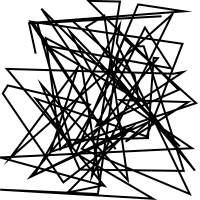

# 🖌️ Cairo in Rust using cairo-rs Bindings

How to setup and get started with Cairo 2D graphics library in Rust.

Some ressources:

* [Cairo Documentation](https://www.cairographics.org/documentation/)
* [Blog Post by Keith Peters](https://medium.com/@bit101/intro-to-cairo-graphics-in-rust-35470a6aed86)
* [The cairo-rs Project's Page](https://gtk-rs.org/gtk-rs-core/stable/latest/docs/cairo/)

# Compiling Cairo

To use the cairo binding, the cairo dll must be installed on your machine. The best way is to directly compile it from source.

## On Windows

Install *MSYS2* using the executable found [here](https://www.msys2.org/). Launch the *MSYS2* terminal.

````MSYS2
pacman -Syu
pacman -S mingw-w64-x86_64-pkg-config mingw-w64-x86_64-cairo mingw-w64-x86_64-glib2
````

Add the *MSYS2* binaries to the system **_PATH_** (by default `C:\msys64\mingw64\bin`).

## On Linux

Not tested, for indication only.

````sh
sudo apt update
sudo apt install libcairo2-dev pkg-config
````

# Using Cairo

Add cairo to your Rust project.

````sh
cargo add cairo
````

Add features to the *cairo* crate to handle the file output, like `png`. You wont have access to `write_to_png` without this feature enabled.

````sh
cargo add cairo -F png
````

> Follow the example functions starting by `principle` in ``main.rs``.

Basicaly, one need to:

1. Create a surface into which we will be drawing (the canvas)
2. Create a context through which we will be drawing (the pen)
3. Create a path for the context (the route plan for the pen)
4. Associate properties to the context (what pen color, ...)
5. Stroke or fill based on the path and properties

# Example Functions

| Function | Output |
| -------- | ------ |
| `principle` |  |
| `paint` |  |
| `rand_lines` |  |
| `basics` |  |
| `mask` |  |
| `source1` |  |
| `source2` |  |
| `curves` |  |
| `pattern` |  |
| `scale` |  |
